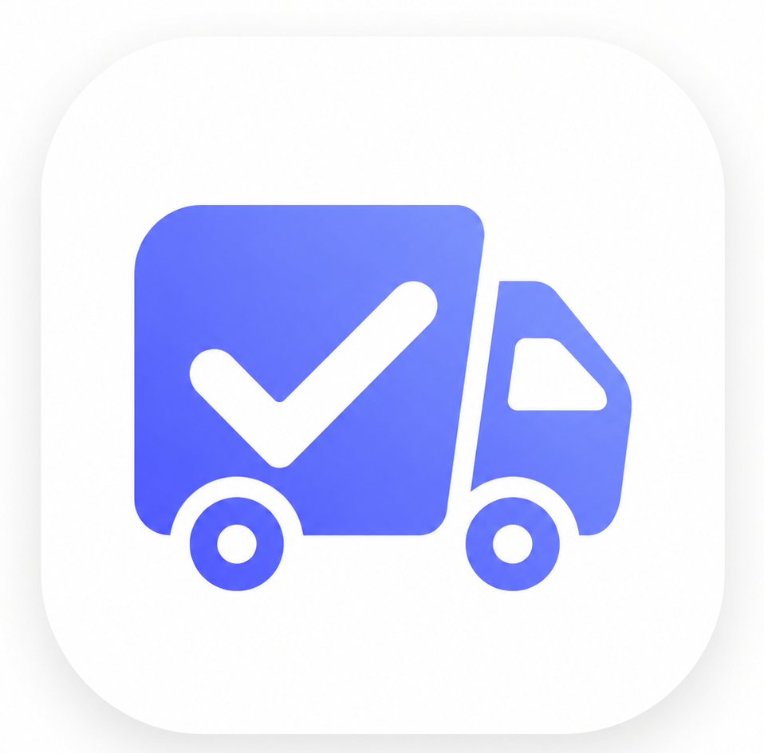

<p align="center">
  
</p>

<h1 align="center">Order Tracker</h1>

<p align="center">
  A production-ready Flutter application for real-time order tracking, built with clean architecture principles and modern Material Design 3 aesthetics.
</p>

<p align="center">
  
  
  
  
  
</p>

---

## 📱 Screenshots

<p align="center">
  
  &nbsp;&nbsp;&nbsp;&nbsp;
  
</p>

<p align="center">
  <em>Orders List — Color-coded status chips</em>
  &nbsp;&nbsp;&nbsp;&nbsp;&nbsp;&nbsp;&nbsp;&nbsp;&nbsp;&nbsp;&nbsp;&nbsp;&nbsp;&nbsp;&nbsp;&nbsp;&nbsp;&nbsp;&nbsp;&nbsp;
  <em>Order Detail — Live tracking timeline</em>
</p>

---

## ✨ Key Features

| Feature | Description |
|---|---|
| **REST API Integration** | Fetches live order data from a remote MockAPI endpoint using Dio |
| **State Management** | Robust Riverpod-based architecture with `Notifier` providers |
| **Real-time Connectivity** | Detects online/offline status and displays a persistent banner |
| **Error Handling** | Graceful error states with retry functionality and a "Force Error" toggle for testing |
| **Pull-to-Refresh** | Swipe down to reload the latest order data |
| **Animated Timeline** | Staggered drop-down animation on the tracking history with dotted/solid progress lines |
| **Dynamic Status Chips** | Each order status (Placed, Packed, Shipped, Out for Delivery, Delivered, Cancelled) has a unique color palette and icon |
| **Custom Splash Screen** | Branded splash screen with the app logo on launch |
| **Material Design 3** | Follows Google's latest MD3 design language with soft drop shadows and modern typography |

---

## 🏗️ Architecture & Tech Stack

```
lib/
├── main.dart                  # App entry point (ProviderScope + MaterialApp)
├── models/
│   └── order.dart             # Data models (Order, OrderStatus, OrderStatusHistory)
├── providers/
│   └── order_provider.dart    # Riverpod state management (Notifier + connectivity)
├── screens/
│   ├── splash_screen.dart     # Animated splash screen
│   ├── orders_list_screen.dart # Main list view with pull-to-refresh
│   └── order_detail_screen.dart # Detailed order view with tracking timeline
├── services/
│   └── api_service.dart       # REST API layer (Dio HTTP client + mock fallback)
├── theme/
│   └── app_theme.dart         # Material 3 theme tokens (colors, typography, shapes)
├── utils/
│   └── formatters.dart        # Date, time, and currency formatters
└── widgets/
    ├── order_list_tile.dart    # Reusable order card widget
    ├── status_timeline.dart   # Animated vertical timeline with dotted lines
    └── footer_credit.dart     # Attribution widget
```

### Tech Stack

| Layer | Technology |
|---|---|
| **Framework** | Flutter 3.10+ |
| **Language** | Dart 3.10+ |
| **State Management** | Riverpod (`flutter_riverpod`) |
| **HTTP Client** | Dio |
| **Connectivity** | `connectivity_plus` |
| **Animations** | `flutter_staggered_animations` |
| **Typography** | Google Fonts |
| **Deep Linking** | `url_launcher` |

---

## 🚀 Getting Started

### Prerequisites

- Flutter SDK `>=3.10.0`
- Dart SDK `>=3.10.0`
- Android Studio / VS Code
- An Android emulator or physical device

### Installation

```bash
# 1. Clone the repository
git clone https://github.com/Nikesh1626/Order-Tracker.git
cd Order-Tracker

# 2. Install dependencies
flutter pub get

# 3. Run the app
flutter run

# 4. Build release APK
flutter build apk --release
```

---

## 🔌 API Configuration

The app fetches order data from a REST API endpoint. The API URL is configured in:

```
lib/services/api_service.dart → kApiUrl
```

The app includes a **built-in mock data fallback** — if the API endpoint is unreachable, it automatically serves hardcoded sample data so the app always remains functional for demonstration purposes.

---

## 🧪 Testing Error & Offline States

### Force Error Mode
Toggle the **"Force Error"** switch in the app bar to simulate a server failure. The app will display a graceful error screen with a **Retry** button.

### Offline Mode
Turn on **Airplane Mode** or disable Wi-Fi/Mobile Data on your device. The app will:
- Instantly show a red **"You are currently offline"** banner
- Preserve previously loaded data on screen
- Automatically recover and dismiss the banner when connectivity is restored

---

## 📦 Project Highlights

- **Clean Architecture** — Separation of concerns across models, services, providers, and UI layers
- **Production Patterns** — Includes error boundaries, connectivity listeners, graceful degradation, and loading states
- **No Third-Party UI Libraries** — All UI components (timeline, cards, chips) are hand-built with Flutter's widget system
- **Zero Lint Issues** — Fully passes `flutter analyze` with zero warnings
- **Modern Dart** — Uses null safety, pattern matching, and Dart 3 features

---

## 👤 Author

**Nikesh Parihar**

---

## 📄 License

This project is open source and available under the [MIT License](LICENSE).
